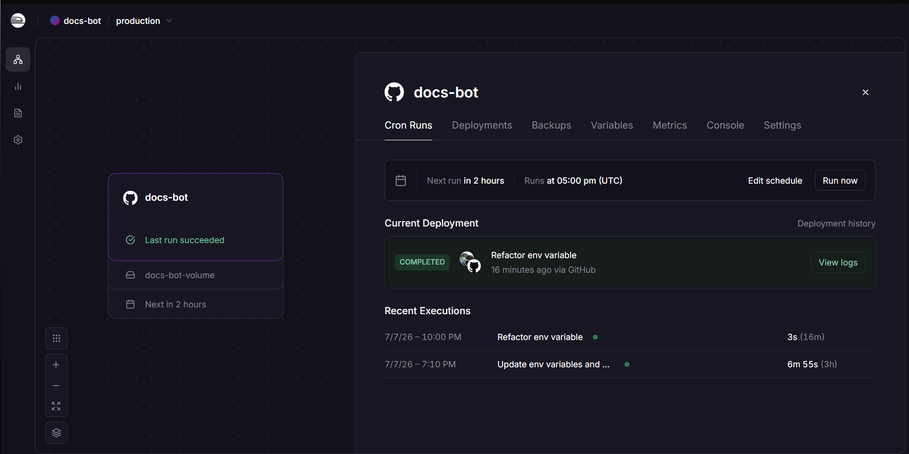
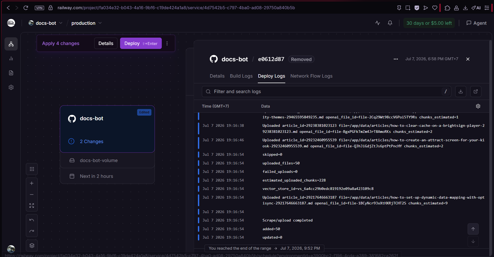
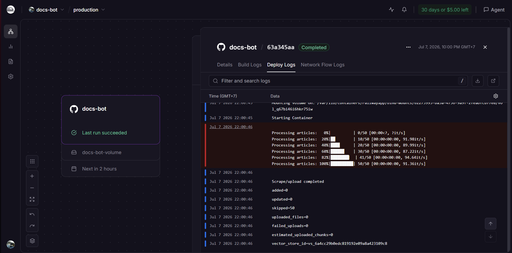
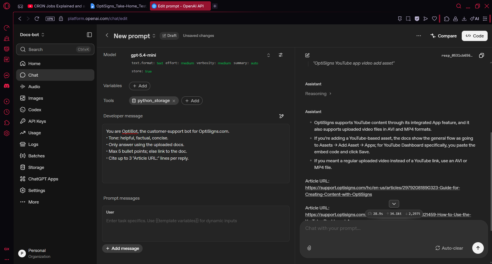

# Docs Bot

A small customer-support knowledge pipeline that scrapes Help Center articles, converts them into clean markdown, detects changed content, and uploads only new or updated documents to an AI vector store.

## Features

- Scrapes Help Center articles through the Zendesk Help Center API
- Converts article HTML into normalized Markdown
- Tracks article hashes to detect `added`, `updated`, and `skipped` files
- Uploads changed Markdown files to an OpenAI Vector Store through API
- Daily scheduled execution on a Railway

## Project structure

```text
main.py
Dockerfile
README.md
src/
  constant.py
  manifest.py
  md_parser.py
  scraper.py
  uploader.py
docs/
	planning.md
screenshot/
.env.sample
requirement.txt
.gitignore
.dockerignore
```

## Setup

Create `.env` from the sample file:

Example:
```env
OPENAI_API_KEY=your_api_key
OPENAI_VECTOR_STORE_ID=your_vector_store_id
OPENAI_VECTOR_STORE_NAME=your_vector_store_name
DATA_DIR=/app/data
BASE_URL=your_help_center_base_url
ARTICLE_FETCH_SIZE=50
```

- OPENAI_API_KEY: API key used to upload Markdown files to OpenAI.
- OPENAI_VECTOR_STORE_ID: existing vector store ID
- OPENAI_VECTOR_STORE_NAME: vector store name used when OPENAI_VECTOR_STORE_ID is not provided to create a new one.
- DATA_DIR: local directory for generated Markdown files and sync state.
- ARTICLE_FETCH_SIZE: maximum number of articles to fetch.
- BASE_URL: base URL of the Help Center source.

`BASE_URL=your_help_center_base_url`

The target URL is intentionally not hard-coded in the repository. This keeps the public repo generic and avoids making it easy to discover by searching for the target company's name, which follows the assignment's requirement.

## Install dependencies

```bash
python -m venv .venv
source .venv/bin/activate
pip install -r requirements.txt
```

For Windows PowerShell:

```powershell
python -m venv .venv
.venv\Scripts\Activate.ps1
pip install -r requirements.txt
```

## Run Locally

```bash
python main.py
```

The script runs once, then exits. Each run:

1. Fetches articles from the Help Center
2. Converts article HTML to Markdown
3. Computes content hashes
4. Uploads only new or changed files
5. Logs summary counts: `added`, `updated`, `skipped`

## Run with Docker

Build the image:

```bash
docker build -t docs-bot .
```

Run with `.env`:

```bash
docker run --rm --env-file .env docs-bot
```

## Chunking Strategy

Files are uploaded to OpenAI Vector Store with static chunking:

- max chunk size: 800 tokens
- overlap: 200 tokens

Support articles often contain step-by-step instructions, so each chunk needs enough context to preserve the meaning of a section. The overlap helps when an instruction is split between two chunks.

## Daily Job

The scraper is deployed as a daily one-shot job.

Cron setup for daily job:


First run's log: Added new articles to vertor store


Second run's log: Skipped all added artiles


## Screenshots

### Assistant sample answer

The assistant answers using uploaded documentation and includes cited article URLs.


